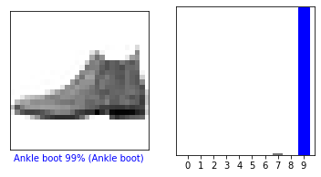
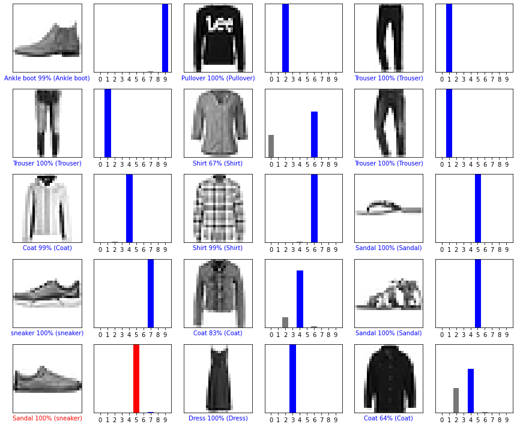

## Project: Image Classification with TensorFlow

Image Classification can also be done by using less complex models provided by Scikit-Learn, so why TensorFlow. By using TensorFlow we can build a neural network for the task of Image Classification. By building a neural network we can discover more hidden patterns than just classification.
Let’s get started with the task of Image Classification with TensorFlow by importing some necessary packages


```python
# TensorFlow and tf.keras
import tensorflow as tf
from tensorflow import keras

# Helper libraries
import numpy as np
import matplotlib.pyplot as plt
```

### Import the Fashion MNIST dataset

In the dataset, each image is mapped into a single label. Since the class names are not defined in the dataset, we need to store them here so that we can use them later when viewing the images


```python
fashion_mnist = keras.datasets.fashion_mnist
(train_images, train_labels), (test_images, test_labels) = fashion_mnist.load_data()

class_names = ['T-shirt/top', 'Trouser', 'Pullover', 'Dress', 'Coat', 'Sandal', 'Shirt',
              'sneaker', 'Bag', 'Ankle boot']
```

### Preprocess the data

For this task of Image Classification with TensorFlow, the data must be preprocessed before training the neural network. If we inspect the first frame of the training set, we find that the pixel values are between 0 and 255.


```python
plt.figure()
plt.imshow(train_images[0])
plt.colorbar()
plt.grid(False)
plt.show()
```


"/images/output_5_0.png"


Now we're going to scale these values to a range of 0 to 1 before passing them to the neural network model. To do this, we need to divide the value by 255. The training set and the test set should be preprocessed in the same way


```python
train_images = train_images / 255.0
test_images = test_images / 255.0
```

To verify that the data is in the correct format and to verify that we are ready to create and train the neural network for image classification with TensorFlow, let’s display the first 25 images of the training set and display the name of the class under each image.


```python
plt.figure(figsize=(10,10))
for i in range(25):
    plt.subplot(5,5,i+1)
    plt.xticks([])
    plt.yticks([])
    plt.grid(False)
    plt.imshow(train_images[i], cmap=plt.cm.binary)
    plt.xlabel(class_names[train_labels[i]])
plt.show()  
```


### Building model

Now to Build the neural network for the task of Image Classification with TensorFlow, we first need to configure the model layers and then move forward with compiling the model.

### Setting up the layers

The basic building block of neural networks is its layers. Layers work by extracting the representations from data fed into them. Most of the deep learning, Models involves doing simple layers together. Now, let’s create the layers of our neural network.


```python
model = keras.Sequential([keras.layers.Flatten(input_shape=(28,28)),
                         keras.layers.Dense(128, activation='relu'),
                         keras.layers.Dense(10)])
```

### Compiling the model


```python
model.compile(optimizer='adam', loss=tf.keras.losses.SparseCategoricalCrossentropy(from_logits=True),
             metrics=['accuracy'])
```

### Train the model

Now, let’s train the Neural Network for the task of Image Classification with TensorFlow, and make predictions on it.


```python
# Fitting the model
model.fit(train_images, train_labels, epochs=10)

# Evaluate accuracy
test_loss, test_acc = model.evaluate(test_images, test_labels, verbose=2)
print('\nTest accuracy:', test_acc)
```

    Train on 60000 samples
    Epoch 1/10
    60000/60000 [==============================] - 10s 170us/sample - loss: 0.4998 - accuracy: 0.8240
    Epoch 2/10
    60000/60000 [==============================] - 12s 204us/sample - loss: 0.3723 - accuracy: 0.8671
    Epoch 3/10
    60000/60000 [==============================] - 11s 187us/sample - loss: 0.3360 - accuracy: 0.8777
    Epoch 4/10
    60000/60000 [==============================] - 10s 170us/sample - loss: 0.3122 - accuracy: 0.8847
    Epoch 5/10
    60000/60000 [==============================] - 10s 173us/sample - loss: 0.2946 - accuracy: 0.8906- loss: 0.2
    Epoch 6/10
    60000/60000 [==============================] - 12s 196us/sample - loss: 0.2819 - accuracy: 0.8952
    Epoch 7/10
    60000/60000 [==============================] - 10s 167us/sample - loss: 0.2684 - accuracy: 0.9006
    Epoch 8/10
    60000/60000 [==============================] - 10s 164us/sample - loss: 0.2560 - accuracy: 0.9049
    Epoch 9/10
    60000/60000 [==============================] - 11s 191us/sample - loss: 0.2484 - accuracy: 0.9069
    Epoch 10/10
    60000/60000 [==============================] - 10s 163us/sample - loss: 0.2411 - accuracy: 0.9098
    10000/10000 - 1s - loss: 0.3301 - accuracy: 0.8848

    Test accuracy: 0.8848


```python
# Make predictions
probability_model = tf.keras.Sequential([model, tf.keras.layers.Softmax()])
predictions = probability_model.predict(test_images)
predictions[0]
```


    array([2.9633294e-09, 1.1889466e-08, 7.7731094e-10, 1.1212509e-09,
           3.4692440e-09, 1.7551950e-04, 1.1557735e-09, 8.5457638e-03,
           4.4213289e-10, 9.9127871e-01], dtype=float32)


The prediction is an array of 10 numbers. They represent the “confidence” of the model that the image matches each of the 10 different garments. Let’s see which label has the highest confidence value


```python
np.argmax(predictions[0])
```


    9


Thus, the model is most convinced that this image is an ankle boot, or class_names [9]. Examination of the test label shows that this classification is correct. Let plot our predictions.


```python
def plot_image(i, predictions_array, true_label, img):
    true_label, img = true_label[i], img[i]
    plt.grid(False)
    plt.xticks([])
    plt.yticks([])
    plt.imshow(img, cmap=plt.cm.binary)

    predicted_label = np.argmax(predictions_array)
    if predicted_label == true_label:
        color = 'blue'
    else:
        color = 'red'

    plt.xlabel('{} {:2.0f}% ({})'.format(class_names[predicted_label],
                                        100*np.max(predictions_array),
                                        class_names[true_label]),
              color=color)   

def plot_value_array(i, predictions_array, true_label):
    true_label = true_label[i]
    plt.grid(False)
    plt.xticks(range(10))
    plt.yticks([])
    thisplot = plt.bar(range(10), predictions_array, color='#777777')
    plt.ylim([0, 1])
    predicted_label = np.argmax(predictions_array)

    thisplot[predicted_label].set_color('red')
    thisplot[true_label].set_color('blue')
```

### Verify predictions

Let's look at the 0th frame of the predictions and prediction table. The correct prediction labels are blue and the incorrect prediction labels are red


```python
i = 0
plt.figure(figsize=(6,3))
plt.subplot(1,2,1)
plot_image(i, predictions[i], test_labels, test_images)
plt.subplot(1,2,2)
plot_value_array(i, predictions[i], test_labels)
plt.show()
```





```python
# Plot the first X test images, their predicted labels, and the true labels.
# Color correct predictions in blue and incorrect predictions in red.
num_rows = 5
num_cols = 3
num_images = num_rows*num_cols
plt.figure(figsize=(2*2*num_cols, 2*num_rows))
for i in range(num_images):
  plt.subplot(num_rows, 2*num_cols, 2*i+1)
  plot_image(i, predictions[i], test_labels, test_images)
  plt.subplot(num_rows, 2*num_cols, 2*i+2)
  plot_value_array(i, predictions[i], test_labels)
plt.tight_layout()
plt.show()
```





### Conclusion

The output looks great, only the boot is recognized wrong as sandal.
